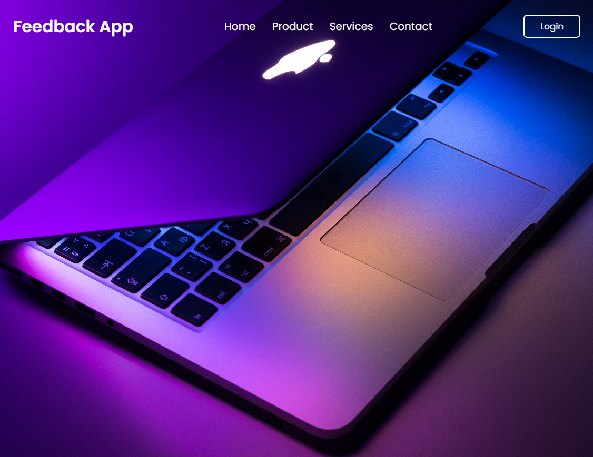
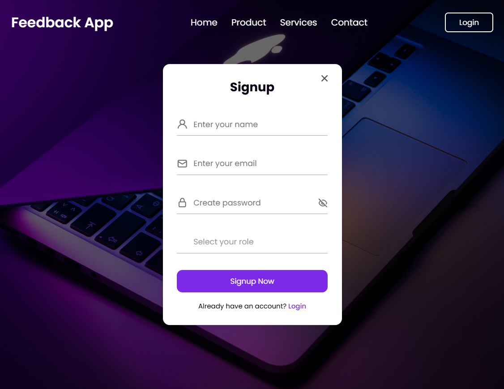
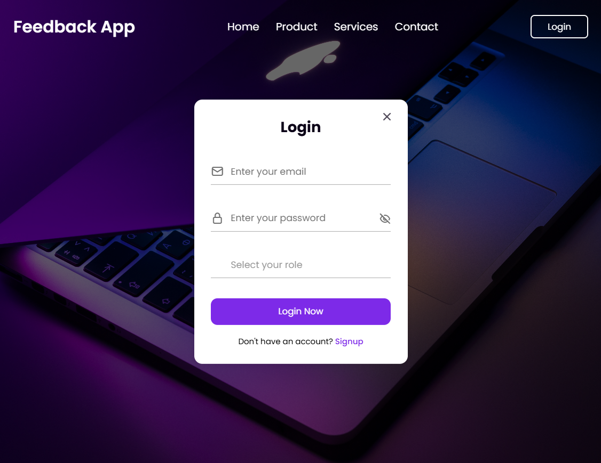
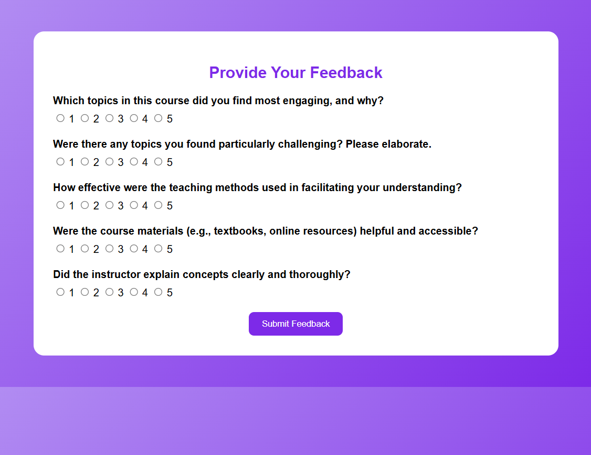

# 📊 Feedback Management System

A full-stack web application that enables users to submit feedback and allows admins to manage questions and analyze ratings. Built using Java Servlets, JDBC, and MySQL with a responsive frontend in HTML, CSS, and JavaScript.

---

## 📘 Project Overview

**Technologies Used**: Java · Servlets · JDBC · MySQL · HTML · CSS · JavaScript · Apache Tomcat

- 🧩 Built a full-stack feedback platform that allows users to submit feedback and admins to manage questions and analyze responses.
- 🔐 Implemented a **role-based login system** with secure **session management** using Java Servlets and JDBC.
- 🛠️ Enabled admins to **add**, **edit**, and **delete** feedback questions and view **average ratings** for each question.
- 🎨 Designed a **responsive and interactive UI** using HTML, CSS, and JavaScript for enhanced user experience.

---

## 🚀 Features

- 👨‍🎓 **User Login & Feedback Submission**
- 👨‍🏫 **Admin Login & Dashboard**
- 📄 Add/Edit/Delete Questions (Admin)
- 📊 View Average Feedback Ratings (Admin)
- 🔐 Session Management for Access Control
- 📱 Responsive Web Interface

---

## 🖼️ Screenshots

> _Ensure these image files are present in your `screenshots/` folder in the repo._

### 🏠 Front Page  


---
### 🔐 Signup  


---

### 🔐 Login  


---

### 🏠 Admin Dashboard  


---

### 📄 Feedback Form  


---


## 🛠️ Tech Stack

- **Frontend**: HTML, CSS, JavaScript  
- **Backend**: Java Servlets  
- **Database**: MySQL  
- **Database Access**: JDBC  
- **Server**: Apache Tomcat  
- **IDE**: Eclipse

---

## ⚙️ How to Run Locally

1. **Clone the Repository**
   ```bash
   git clone https://github.com/lukeshsable/FeedbackApp.git
   cd FeedbackApp
